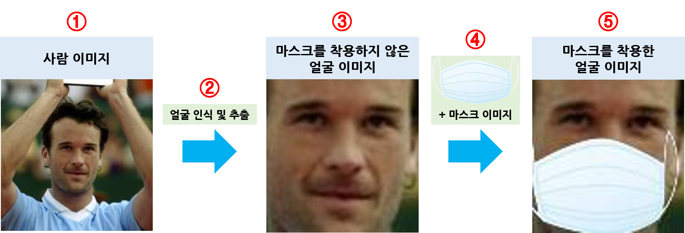

  

     
  

## 마스크 착용 유무 판단 시스템
* ### 학습 dataset 생성

  

     
  

  #### ① 사람 이미지(with_mask_create/face_images) : 1000개의 사람 이미지 파일
  #### ② 얼굴 인식 및 추출(with_mask_create/face_detector.py) : 사람 이미지 파일에서 얼굴 인식 및 추출 후 저장
    ##### 실행 : sudo python3 face_detector.py
  #### ③ 마스크를 착용하지 않은 얼굴 이미지(dataset/without_mask) : 추출한 1000개의 마스크를 착용하지 않은 얼굴 이미지 파일
  #### ④ 마스크를 착용한 이미지 생성(with_mask_create/with_mask_create.py + with_mask_create/face_masker.py) : 추출한 얼굴 이미지 파일에 마스크 이미지(mask_images)를 추가하여 마스크(흰색, 검은색, 파란색)를 착용한 이미지 생성
    ##### 실행 : sudo python3 with_mask_create.py
  #### ⑤ 마스크를 착용한 얼굴 이미지(dataset/with_mask) : 마스크 이미지를 추가한 1000개의 마스크를 착용한 얼굴 이미지 파일(흰색 마스크 착용 600개, 검은색 마스크 착용 300개, 파란색 마스크 착용 100개)

---
### 실행 환경
* #### Ubuntu
* #### OpenCV Version : 3.x.x
  * ##### 설치 : https://blog.naver.com/dldudcks1779/222020005648
* #### imutils
  * ##### 설치 : sudo pip3 install imutils
  
---
## 이미지 얼굴 인식
* #### 이미지를 저장하지 않을 경우
  * sudo python3 face_detection_image.py --input 이미지 경로
    * 예) sudo python3 face_detection_image.py --input ./face_image.jpg
* #### 이미지를 저장할 경우
  * sudo python3 face_detection_image.py --input 이미지 경로 --output 저장할 이미지 경로
    * 예) sudo python3 face_detection_image.py --input ./face_image.jpg --output ./result_face_image.jpg

  

     
    
  

---
## 비디오 얼굴 인식 - 웹캠 또는 동영상(webcam or video)
* #### 비디오를 저장하지 않을 경우
  * webcam : sudo python3 face_detection_video.py
    * 예) sudo python3 face_detection_video.py
  * video : sudo python3 face_detection_video.py --input 비디오 경로
    * 예) sudo python3 face_detection_video.py --input ./face_video.avi
* #### 비디오를 저장할 경우
  * webcam : sudo python3 face_detection_video.py --output 저장할 비디오 경로
    * 예) sudo python3 face_detection_video.py --output ./result_face_video.avi
  * video : sudo python3 face_detection_video.py --input 비디오 경로 --output 저장할 비디오 경로
    * 예) sudo python3 face_detection_video.py --input ./face_video.avi --output ./result_face_video.avi

---
